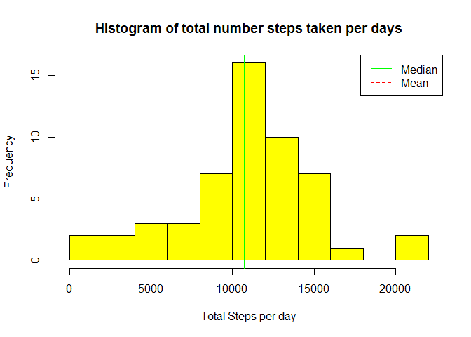
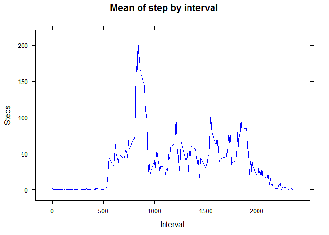
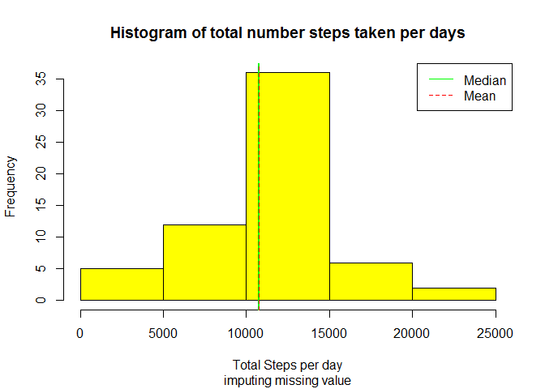
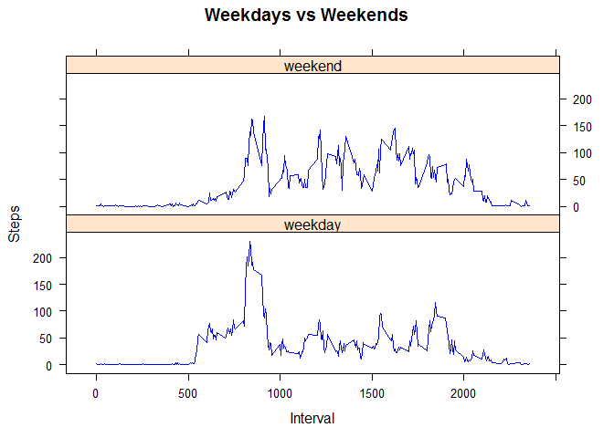

# Reproducible Research: Peer Assessment 1
This research makes use of data from a personal activity monitoring device. This device collects data at 5 minute intervals through out the day. 
The data used consists of two months of data from an anonymous individual collected during the months of October and November, 2012 and include the number of steps taken in 5 minute intervals each day.

The study consists of comparing the total steps per day with vs without missing values. 
In addition, the average of steps per interval is evaluated through all the days and the comparing the same average but grouping weekdays and weekends.


```r
        library(plyr)
        library(dplyr)
        library(lattice)

        old <- Sys.getlocale()
        Sys.setlocale("LC_TIME","English")  ## Mon, Tue, Wed...
```

```
## [1] "English_United States.1252"
```
Note: change the setlocale because the weekdays() function returns the name of the day of the week according to setting language, the following code works for English names (Monday, Tuesday, etc.)


## Loading and preprocessing the data
Read the data and get the rows that do not have missing values

```r
        activity <- read.csv("activity.csv")
        act_no_NA <- activity[!is.na(activity$steps),]
```


## What is mean total number of steps taken per day?
As can apreciate in the following histogram, most days have a total of steps between 10000 and 12000 steps.


```r
        group_days <- group_by(act_no_NA, date)
        sum_day <- summarize(group_days, steps = sum(steps))

        hist(sum_day$steps, col = "yellow", 
                main = "Histogram of total number steps taken per days",
                xlab = "Total Steps per day",
                breaks = 10
        )

        meanstep <- mean(sum_day$steps)
        medianstep <- median(sum_day$steps)

        abline(v=medianstep, col="green", lwd=2)
        abline(v=meanstep, col="red", lty = 2)
        legend("topright",lty=c(1,2), col = c("green","red"), legend = c("Median", "Mean"))
```

<!-- -->

The mean total number of steps taken per day is 10766.19 and the median total number of steps taken per day is 10765


## What is the average daily activity pattern?
From the analysis by interval it can be deduced that the greater daily activity occurs in the morning (between 8 and 9:30 AM) and low during the night hours.


```r
        group_intervals <- group_by(act_no_NA, interval)
        mean_interval <- summarize(group_intervals, steps = mean(steps))

        with(mean_interval,
                xyplot(steps~interval, 
                        main="Mean of step by interval", 
                        type = "l", 
                        col = "blue", 
                        xlab = "Interval", 
                        ylab = "Steps"
                )
        )
```

<!-- -->

```r
        max_interval <- with(mean_interval, interval[which.max(steps)])
```
On average across all the days in the dataset, the [835,840] minutes interval contains the maximun numbers of steps.


## Imputing missing values

```r
        tot_NA <- sum(is.na(activity$steps))
```
There are 2304 rows with missing value for step
These values will be completed according to the following strategy:
 Missing values for a given interval will be completed with the mean for that interval across all days.

 

```r
        stepNA <- is.na(activity$steps)
        activ_complete <- activity
        for (i in which(stepNA)){
                meanind <- mean_interval$interval==activ_complete$interval[i]
                activ_complete$steps[i] <- mean_interval$steps[meanind]
        }
```

Now plot the histogram again and calculate the mean and median.

```r
        group_days <- group_by(activ_complete, date)
        sum_day <- summarize(group_days, steps = sum(steps))
        hist(sum_day$steps, col = "yellow", 
                main = "Histogram of total number steps taken per days",
                sub = "imputing missing value",
                xlab = "Total Steps per day")
        meanstepnoNA <- mean(sum_day$steps)
        medianstepnoNA <- median(sum_day$steps)
        abline(v=medianstepnoNA, col="green", lwd=2)
        abline(v=meanstepnoNA, col="red", lty = 2)
        legend("topright",lty=c(1,2), col = c("green","red"), 
                legend = c("Median", "Mean"))
```

<!-- -->

After complete the missing values, the mean total number of steps taken per day is 10766.19 and the median total number of steps taken per day is 10766.19. Can apreciate that there are not differ greatly from the initial estimates when the missing values were ignored. The impact of imputation of missing values has been minimal


## Are there differences in activity patterns between weekdays and weekends?
Then it is analyzed if there are differences in the pattern of activity if it is a weekday or a weekend. It is observed that on weekdays the highest level of activity occurs during the 8 and 9:30 in the morning, while during the weekends the activity is more regular throughout the day.


Then analyze whether there are differences in the activity pattern if it is a weekday or a weekend. Observed that during the weekdays the highest level of activity occurs during the 8 and 9:30 in the morning, while during the weekends the activity is more regular throughout the day.


```r
        vweek = c(rep("weekday",5),rep("weekend",2))
        names(vweek) <- c("Mon","Tue","Wed","Thu","Fri","Sat","Sun")
        activ_complete$week <- as.factor(
                vweek[weekdays(as.Date(activ_complete$date),abbreviate=TRUE)])

        col_group <- c("week","interval")
        mean_intw <- ddply(activ_complete, col_group, summarize, steps=mean(steps))

        with(mean_intw,
                xyplot(steps~interval|week, 
                        main="Weekdays vs Weekends", 
                        type = "l", 
                        col = "blue", 
                        xlab = "Interval", 
                        ylab = "Steps",
                        layout = c(1,2)
                )
        )
```

<!-- -->

Restore setlocale to the origin setting

```r
        Sys.setlocale(locale = old)
```

```
## [1] ""
```
